## Dependencies

* [Auth0 account](https://www.auth0.com)

### The problem

The project's boilerplate provide an initial Auth0 domain setup, now we need to create a 
new and exclusive one to use instead. 


### Step 1 - Log in to your Auth0 account

This is straightforward, simply go to [Auth0 login page](https://auth0.com/auth/login) and access  your account


### Step 2 - Start the `Auth0 application` creation process

From your Auth0's Dashboard, hit the orange button located in the top-right of your screen.

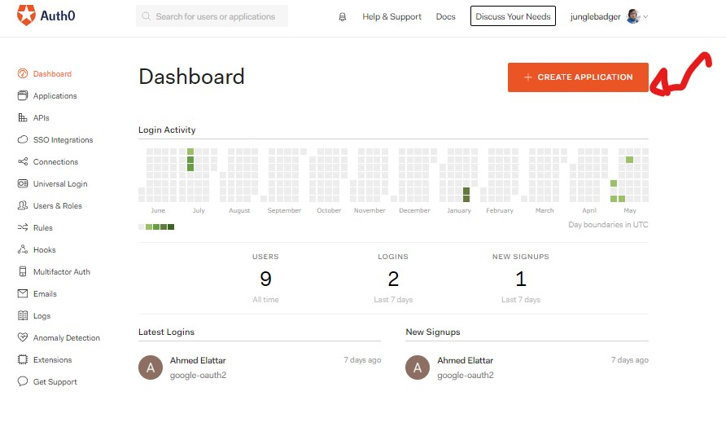


### Step 3 - Select the application type

Here I advise you creating `Single Page Application` or `Machine to Machine`, both will work.


### Step 4 - Configure your new application

Now you will have to focus in the `Application URIs` section.

The Auth0 UI provides good information about each field, so I will simply add an image reference on how to set this up.

> **Attention: the `Application Login URI` field must remain empty and the other fields unchanged**

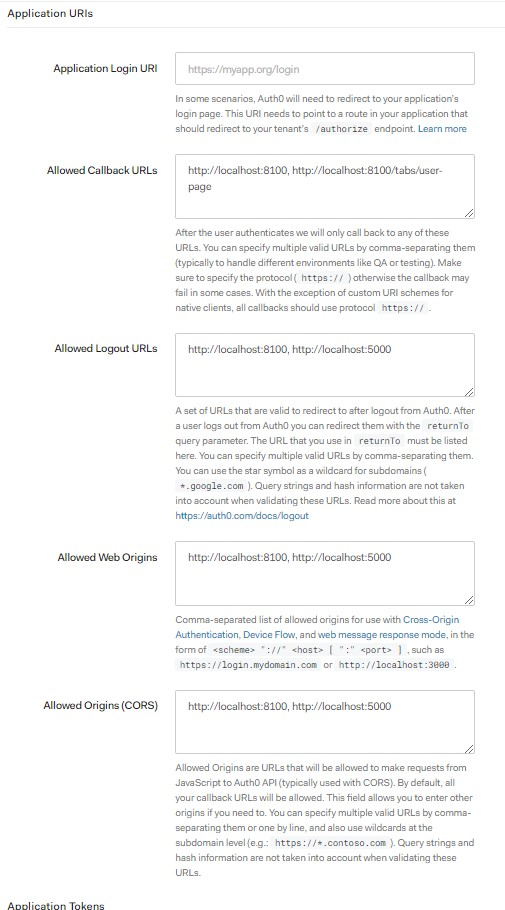


### Step 5 - Create the API of your application

Through your left-menu you can reach the `APIs` section and click the orange button in the top-right.

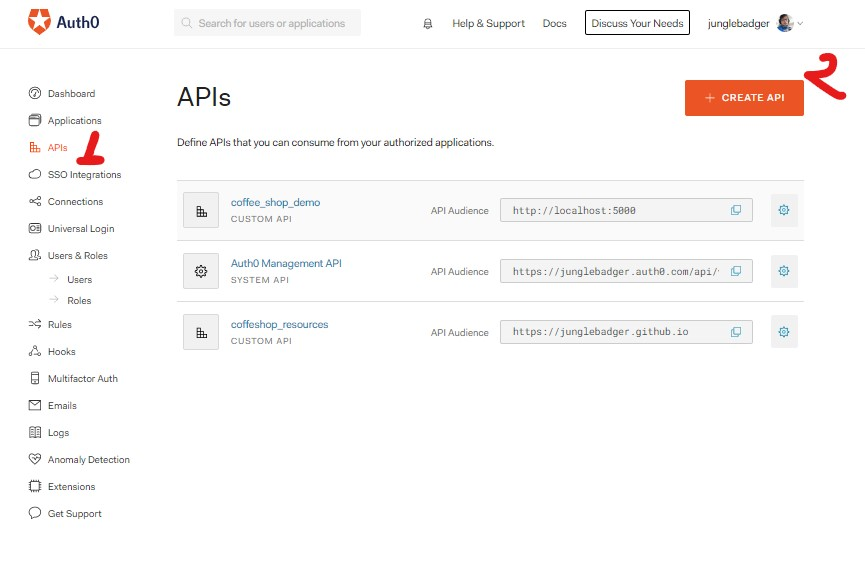

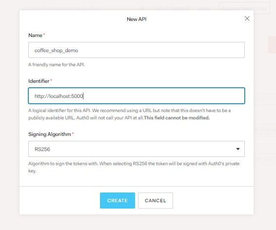


### Step 6 - Configure your API - Enable RBAC

This step is necessary to allow this API to carry out permissions within the token. Look for the
 `RBAC Settings` field and enable both options there.
 
 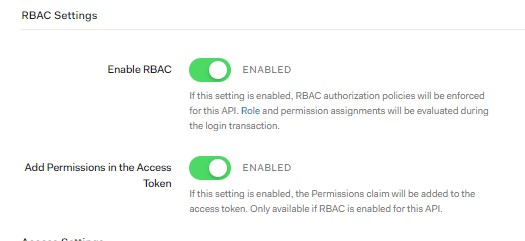


### Step 7 - Configure your API - Create the permissions

Now go to the `permissions` tab and add the permissions described on the project's guide

* get:drinks-detail	
* post:drinks	
* patch:drinks	
* delete:drinks	

 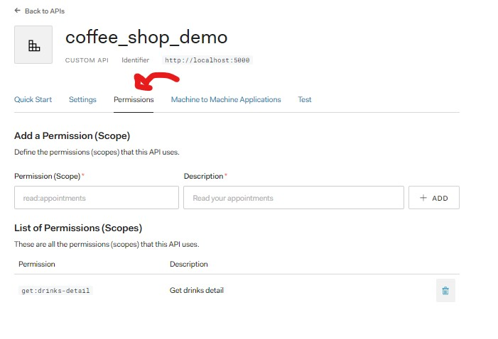


### Step 8 - Create the roles

Through your left-menu you can reach the `roles` section and click the orange button in the top-right.

You will have to create two roles `Barista` & `Manager` there.

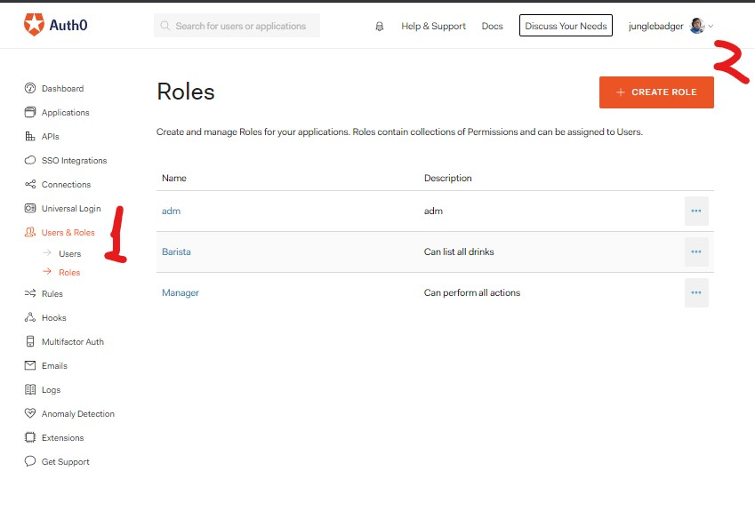


### Step 9 - Configure the roles - Assign permissions

After that, click in the `permissions` tab 
and add the required permissions for each role through the blue button `Add permission`. 

The permissions were created in the Step 7. 


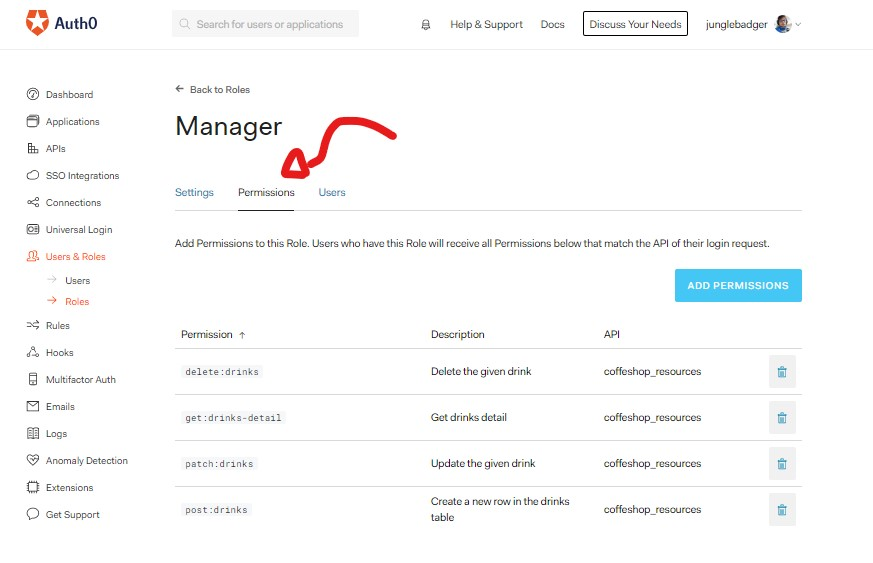


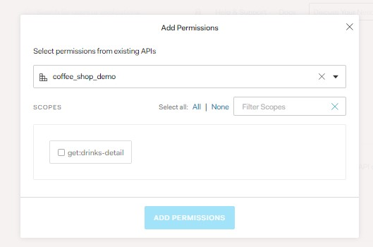


### Step 10 - Configure the roles - Assign users

Now you have to configure some users (emails) to actually receive those permissions upon a successful login

You can create users in the left-menu using custom emails, or assign them later upon a Google login.

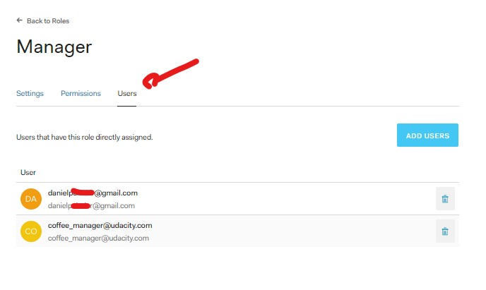


### Step 11 - Configure your Auth.py (backend)

Now that we have:
* Auth0 dashboard
* Auth0 application
* Auth0 API
* Auth0 roles & permissions

We can go ahead and update the code, the first step will be the python app.

In the [`/backend/src/auth/auth.py`](/backend/src/auth/auth.py) fill the information with the ones you generated above.


### Step 12 - Configure your environment.ts (frontend)

Go to the [`/frontend/src/environments/environment.ts`](/frontend/src/environments/environment.ts)
and update the values there as well.

Note that `apiServerURL` will be your Python running address:port and the callbackURL must be your frontend app.

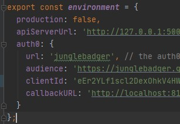


### Step 13 - Start your frontend

At this point you must be all set, from the `frontend` folder run the following commands

```shell script
npm install
ionic serve
```


### Step 14 - Login to your app and fetch the token

Simply go to your browser and access the localhost:8100, login with a registered user and fetch the token.

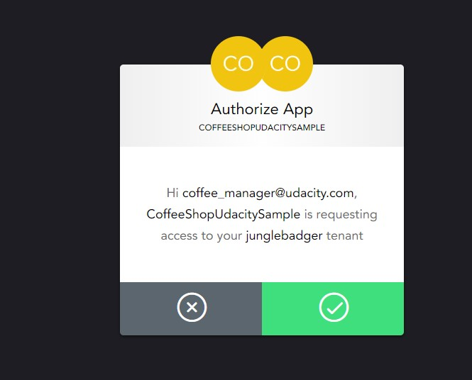


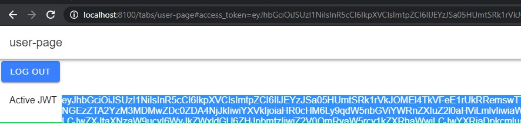


### Step 15 - Validate the token

Copy the token generated in the screen and go to [JWT.io](https://jwt.io) to validate your token.


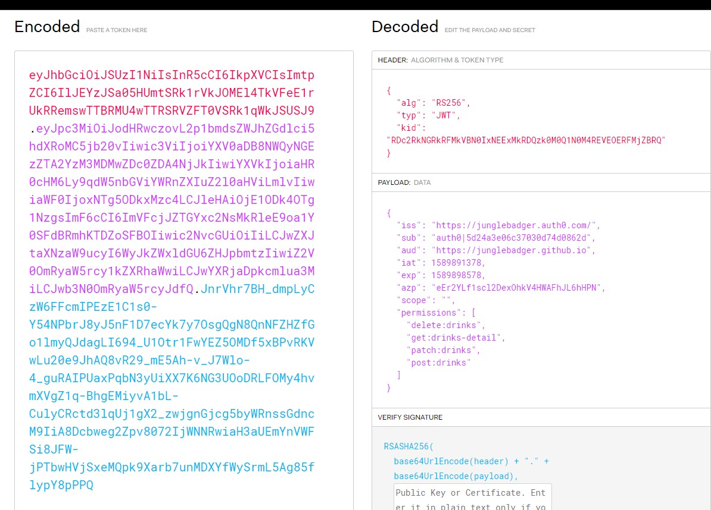


### Step 16 - Update the POSTman collection

Refer to [this guide](update_postman.md)