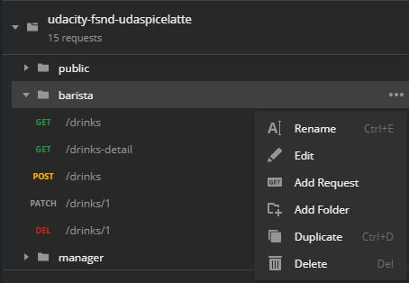
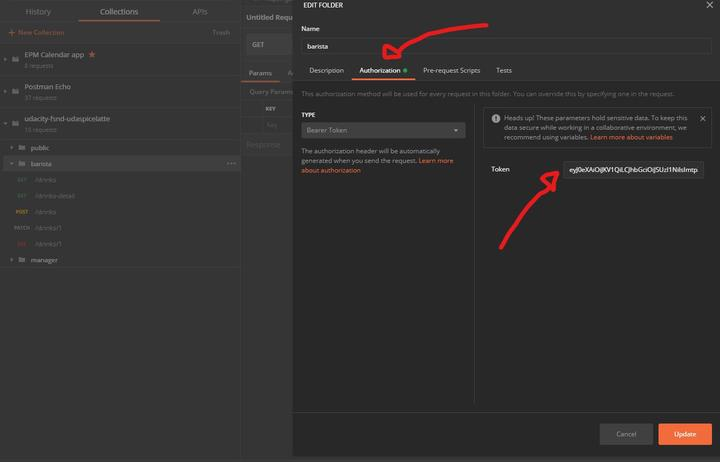
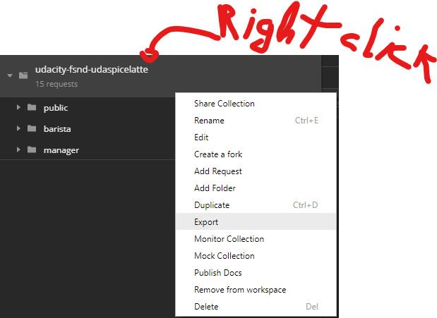

## Dependencies

* [POSTman](https://www.postman.com/downloads/)
* [Generate token guide completed](./generate_token.md)

### The problem

The generated JWT tokens must be configured within the [provided POSTMan JSON collection](../backend/udacity-fsnd-udaspicelatte.postman_collection.json)

### Step 1 - Update `barista` and `manager` separately

### Step 2 - Update the token value in `Authorization` tab

### Step 3 - Save and export the collection

